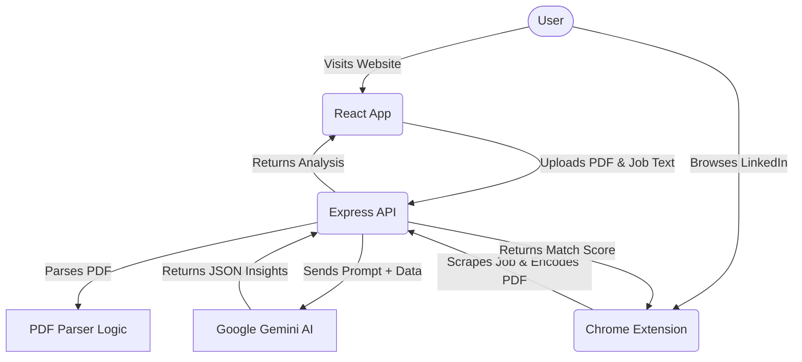

# ResumeAnalyzer 🚀

ResumeAnalyzer is a comprehensive, AI-powered platform designed to bridge the gap between your resume and your dream job. By leveraging advanced generative AI (Google Gemini), it intelligently analyzes your resume against target job descriptions to give you actionable insights, match scores, and interview preparation tools.

---

## ✨ Key Features

- **🎯 Job Match Scoring**: Instantly see how well your resume aligns with a job description. The AI calculates a match percentage based on skills, experience, and keywords.
- **🔍 Skill Gap Analysis**: Discover missing skills and keywords required by the employer. The system provides actionable suggestions to add to your resume.
- **🤖 AI Mock Interviews**: Generate tailored interview questions based on your specific resume and the job you want. Submit your answers and receive AI-driven feedback on your communication and technical accuracy.
- **📝 Resume Builder & Optimizer**: Enhance your bullet points, generate new summaries, and rewrite sections to better target specific roles.
- **🌐 Chrome Extension (Mini-Screener)**: A built-in browser extension that lets you extract job details directly from LinkedIn or Indeed, upload your PDF resume, and get an instant match score natively inside the extension!
- **👔 LinkedIn Profile Optimizer**: Get tailored advice on how to tweak your LinkedIn profile to attract recruiters for your desired roles.

---

## 🏗️ Architecture overview



---

## 🛠️ Tech Stack

- **Frontend**: React.js, Vite, Framer Motion (animations), CSS Modules
- **Backend**: Node.js, Express.js, `pdf-parse` (for reading resumes), `multer` (for file uploads)
- **AI Integration**: Google Gemini API (`@google/genai`)
- **Browser Extension**: Chrome Manifest V3 (Vanilla JS, HTML, CSS)

---

## 🚀 Getting Started

### Prerequisites
- Node.js (v16 or higher)
- A Google Gemini API Key ([Get one here](https://aistudio.google.com/app/apikey))

### 1. Backend Setup

1. Navigate to the backend directory:
   ```bash
   cd backend
   ```
2. Install dependencies:
   ```bash
   npm install
   ```
3. Create a `.env` file in the `backend` directory and add your Gemini API Key:
   ```env
   GEMINI_API_KEY=your_api_key_here
   PORT=5000
   ```
4. Start the backend server:
   ```bash
   npm start
   ```

### 2. Frontend Setup

1. Open a new terminal and navigate to the frontend directory:
   ```bash
   cd frontend
   ```
2. Install dependencies:
   ```bash
   npm install
   ```
3. Start the Vite development server:
   ```bash
   npm run dev
   ```
4. Open your browser and go to `http://localhost:5173`.

### 3. Chrome Extension Setup

To use the 1-click LinkedIn/Indeed scraper and mini-screener:
1. Open Google Chrome and navigate to `chrome://extensions/`.
2. Toggle **Developer mode** on in the top right corner.
3. Click **Load unpacked** in the top left.
4. Select the `extension` folder located inside this repository.
5. Pin the extension to your toolbar. Now, whenever you are on a job posting, click the extension, upload your resume, and get an instant score!

---

## 📡 API Endpoints

The backend Express server exposes several critical endpoints for AI analysis:

- `POST /api/analyze`: Takes a PDF and job description text, returns overall match score, skill gaps, and section-by-section feedback.
- `POST /api/analyze/interview`: Generates 5 highly targeted interview questions based on the resume/job match.
- `POST /api/analyze/evaluate-interview`: Evaluates the user's answers to the mock interview questions.
- `POST /api/analyze/rewrite-resume`: Rewrites specific resume sections to better fit a job.

---

## 🐛 Troubleshooting

- **Extension says "Cannot extract data":** Ensure you have reloaded the LinkedIn tab *after* installing the extension. The content script only injects on page load.
- **AI returns "Network Error":** Ensure your Node backend is running on port 5000 and that you have a valid `GEMINI_API_KEY` in your backend `.env` file.
- **PDF fails to parse:** Ensure the uploaded file is a valid text-based PDF. Image-only (scanned) PDFs are not currently supported as they require OCR.

---

## 🤝 Contributing

Contributions are welcome! Please feel free to submit a Pull Request. For major changes, please open an issue first to discuss what you would like to change.

## 📜 License

MIT License. Feel free to use and modify for your own personal career journey!
